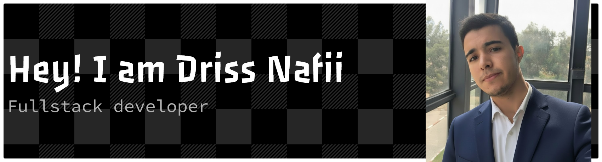

Passionate full-stack developer with expertise in modern web technologies and a strong foundation in both frontend and backend development. I focus on building scalable, user-centric applications that solve real-world problems.

  
  

### Programming Languages

### Frontend Development

### Backend Development

### Databases

### Tools & DevOps

## 🎯 Current Focus

I'm currently expanding my expertise in cloud technologies and microservices architecture while continuing to build innovative web applications that provide exceptional user experiences.

  

  

  <!-- Footer Animation: Gradient Wave + Clean Style -->
  

